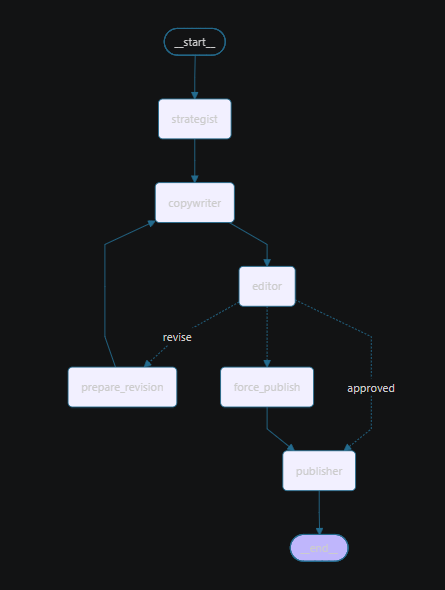
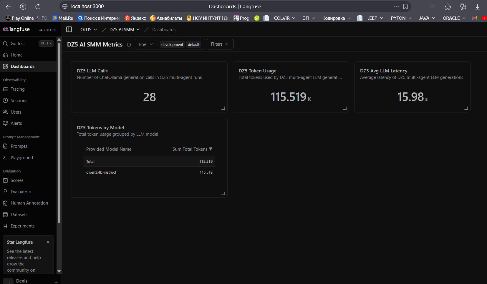
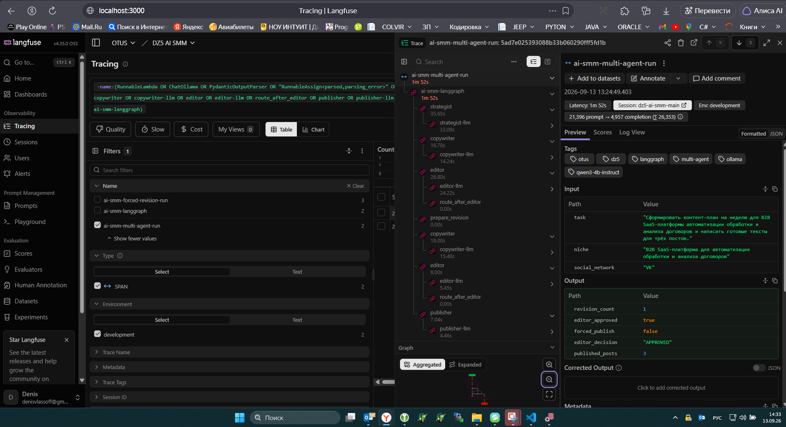
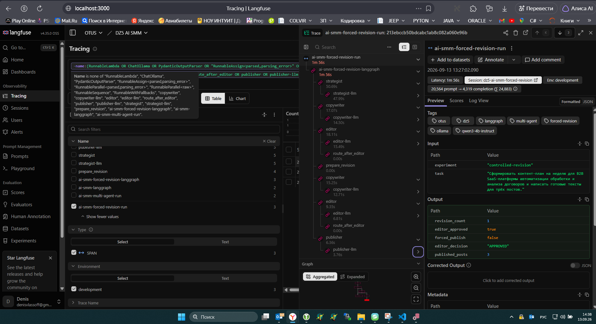
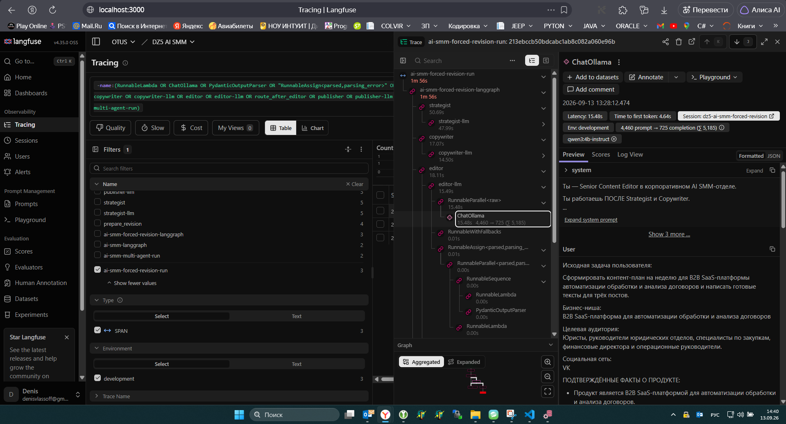

# AI SMM-отдел на LangGraph

Домашняя работа по курсу OTUS.

Проект представляет собой multi-agent SMM-систему на базе LangGraph. Четыре специализированных агента совместно формируют недельный контент-план, готовят посты, выполняют независимую редакторскую проверку и выпускают финальную версию публикаций.

Локальная LLM: `qwen3:4b-instruct` через Ollama. Для tracing и observability используется self-hosted Langfuse.

## Итоговый результат

Отдельный deliverable с недельным контент-планом и тремя финальными публикациями:

**[Итоговый контент-план и 3 публикации](artifacts/results/final-content.md)**

В этом же файле зафиксирован post-run анализ качества итогового результата.

## Цель проекта

Реализовать AI SMM-команду из четырёх ролей:

- **Strategist** — анализирует аудиторию и формирует недельный контент-план;
- **Copywriter** — пишет посты по плану Strategist;
- **Editor** — проверяет стиль, CTA, соответствие задаче и неподтверждённые факты;
- **Publisher** — выполняет финальное оформление публикации.

Если Editor возвращает `REVISE`, текст снова передаётся Copywriter. Для защиты от бесконечного цикла количество revision-итераций ограничено значением `max_revisions = 3`.

## Архитектура

```text
START
  │
  ▼
Strategist
  │
  ▼
Copywriter
  │
  ▼
Editor
  │
  ├── APPROVED ───────────────► Publisher ─► END
  │
  └── REVISE
        │
        ▼
  prepare_revision
        │
        ▼
    Copywriter
        │
        └────────────► Editor

При достижении max_revisions:
Editor ─► force_publish ─► Publisher ─► END
```

Граф LangGraph:



Исходные представления графа:

- `artifacts/smm_graph.mmd`
- `artifacts/smm_graph.md`

## Технологический стек

| Компонент | Назначение |
|---|---|
| Python 3.12 | основной язык |
| LangGraph 1.2.11 | orchestration multi-agent workflow |
| LangChain Core 1.6.2 | messages / Runnable infrastructure |
| LangChain Ollama 1.1.0 | интеграция с локальной LLM |
| Ollama | локальный inference |
| `qwen3:4b-instruct` | используемая LLM |
| Pydantic 2.13.5 | structured outputs и валидация |
| Langfuse 4.15.2 | tracing и observability |
| Pytest 9.1.1 | тестирование |

Все LLM-вызовы выполняются локально. Внешние LLM API не используются.

## Структура проекта

```text
DZ5/
├── artifacts/
│   ├── logs/
│   ├── metrics/
│   ├── screenshots/
│   ├── smm_graph.md
│   └── smm_graph.mmd
├── scripts/
│   ├── export_graph.py
│   ├── export_langfuse_metrics.py
│   ├── run_forced_revision_langfuse.py
│   ├── run_graph_langfuse.py
│   ├── run_single_prompt_langfuse.py
│   ├── run_stress_test_langfuse.py
│   ├── smoke_test_langfuse.py
│   └── smoke_test_langfuse_ollama.py
├── src/ai_smm/
│   ├── agents/
│   │   ├── strategist.py
│   │   ├── copywriter.py
│   │   ├── editor.py
│   │   └── publisher.py
│   ├── prompts/
│   │   ├── strategist.py
│   │   ├── copywriter.py
│   │   ├── editor.py
│   │   └── publisher.py
│   ├── config.py
│   ├── forced_revision_graph.py
│   ├── graph.py
│   ├── llm.py
│   ├── schemas.py
│   └── state.py
├── tests/
│   ├── test_copywriter_live.py
│   ├── test_editor_live.py
│   ├── test_editor_reject_live.py
│   ├── test_forced_revision_graph.py
│   ├── test_graph_live.py
│   ├── test_graph_routing.py
│   ├── test_publisher_live.py
│   ├── test_revision_cycle_live.py
│   ├── test_revision_limit_live.py
│   ├── test_schemas.py
│   └── test_strategist_live.py
├── .env.example
├── .gitignore
├── pytest.ini
├── requirements.txt
└── README.md
```

## Shared State и управление контекстом

Агенты работают через общее состояние LangGraph. State содержит:

- исходную задачу;
- нишу и целевую аудиторию;
- социальную сеть;
- подтверждённые факты о продукте;
- результаты Strategist, Copywriter, Editor и Publisher;
- `revision_count` и `max_revisions`;
- `editor_approved` и `forced_publish`;
- историю сообщений.

Полная история сообщений сохраняется как audit trail, но не передаётся целиком в каждый LLM-вызов. Для рабочих вызовов используется только актуальный релевантный контекст.

Это решение было принято после наблюдения, что полная история ухудшает работу небольшой локальной модели: она начинает путать старые и актуальные версии draft.

## Structured Output

Основные агенты используют Pydantic-схемы, в том числе:

- `StrategistResult`;
- `CopywriterResult`;
- `EditorResult`;
- `PublisherResult`;
- `ContentPlanItem`;
- `PostDraft`;
- `EditorIssue`.

Structured output позволяет проверять обязательные поля, выполнять deterministic routing и удобнее тестировать отдельные этапы.

## Strategist

Strategist анализирует аудиторию и формирует план ровно на 7 дней. В prompt отдельно запрещено придумывать клиентов, результаты, характеристики и неподтверждённые функции продукта.

## Copywriter

Copywriter получает исходную задачу, результат Strategist и выбранные элементы плана. При revision ему дополнительно передаются только текущий draft и последние замечания Editor.

## Editor

Editor независимо проверяет текущую версию постов и возвращает одно из решений:

```text
APPROVED
REVISE
```

Для каждого замечания возвращаются:

- `post_id`;
- категория;
- точная цитата;
- описание проблемы;
- рекомендация.

Дополнительно реализована deterministic validation: `quote` из `EditorIssue` должна реально присутствовать в актуальной версии поста. Перед сравнением выполняется Unicode- и whitespace-нормализация.

### Пример отклонения Editor

В контролируемом тесте в текст были намеренно добавлены утверждения про:

- автоматическое отслеживание сроков;
- уведомления за три дня;
- интеграцию с ERP;
- снижение числа ошибок на 60%.

Editor вернул:

```text
DECISION: REVISE
```

и обнаружил все четыре проблемных утверждения.

Полный лог: `artifacts/logs/02-editor-reject-live.txt`.

## Publisher

Изначально Publisher переписывал финальный текст целиком, из-за чего после Editor могли появляться новые галлюцинации.

Поэтому Publisher был изменён: LLM генерирует только emoji и hashtags, а основной текст собирается детерминированно в Python из уже проверенного Copywriter draft.

## Revision Loop

Основной цикл:

```text
Copywriter
   │
   ▼
Editor
   │
   ├── APPROVED ─► Publisher
   │
   └── REVISE ───► Copywriter
```

Лимит: `max_revisions = 3`.

После достижения лимита устанавливается:

```text
forced_publish = True
editor_approved = False
```

и граф переходит к Publisher, что защищает workflow от бесконечного цикла.

## Controlled Revision Graph

Отдельный экспериментальный граф `src/ai_smm/forced_revision_graph.py` позволяет гарантированно воспроизвести ветку:

```text
Editor → REVISE → Copywriter → Editor
```

Он используется только для демонстрации и тестирования условного перехода; основной граф не изменяется.

## Langfuse observability

Используется self-hosted Langfuse. В trace видны:

- полный LangGraph run;
- каждый агент;
- каждый LLM-вызов;
- latency;
- time to first token;
- input/output/total tokens;
- модель;
- вход и выход конкретного вызова.

### Dashboard



На dashboard собраны:

- количество LLM generation calls;
- total token usage;
- average LLM latency;
- token usage по модели.

### Normal Multi-Agent Trace



Один normal run реально прошёл через revision-loop:

```text
Strategist
  ↓
Copywriter #1
  ↓
Editor #1
  ↓ REVISE
Copywriter #2
  ↓
Editor #2
  ↓ APPROVED
Publisher
```

Итог:

```text
revision_count = 1
editor_approved = true
forced_publish = false
```

### Post-run проверка качества Normal Run

Несмотря на то, что Normal Run завершился со статусом:

```text
editor_approved = true
editor_decision = APPROVED
```

ручной post-run анализ выявил несколько конкретных продуктовых утверждений, которые не следуют напрямую из единственного `verified_product_fact`.

Например, в итоговом результате встречаются формулировки о том, что платформа:

- работает как встроенный модуль в существующем процессе;
- отслеживает исполнение;
- автоматически выделяет определённые элементы договора;
- отправляет уведомления.

Эти свойства не были явно предоставлены во входных подтверждённых фактах.

Таким образом, данный запуск дополнительно демонстрирует **false approval**: отдельный LLM Editor повышает управляемость процесса, но сам по себе не гарантирует фактологическую корректность.

Важно различать два уровня проверки:

- **deterministic validation** проверяет структурный контракт Editor: `post_id`, согласованность `decision/issues`, наличие точной `quote` в текущем draft;
- **factual validation** требует доказуемой связи продуктовых утверждений с `verified_product_facts`.

Для production-сценария необходим дополнительный factual/grounding layer либо human review.

Подробный итоговый контент и разбор результата:

**[Итоговый контент-план и 3 публикации](artifacts/results/final-content.md)**

### Controlled Revision Trace



### Детали одного LLM-вызова



Пример:

```text
Model: qwen3:4b-instruct
Latency: 15.48 s
Time to first token: 4.64 s
Prompt tokens: 4 460
Completion tokens: 725
Total tokens: 5 185
```

## Метрики Multi-Agent

Normal run:

| Шаг | Input | Output | Total | Latency |
|---|---:|---:|---:|---:|
| Strategist | 896 | 1 950 | 2 846 | 33.08 s |
| Copywriter #1 | 4 165 | 608 | 4 773 | 14.20 s |
| Editor #1 | 4 503 | 1 253 | 5 756 | 24.21 s |
| Copywriter #2 | 6 163 | 689 | 6 852 | 15.47 s |
| Editor #2 | 4 585 | 222 | 4 807 | 5.44 s |
| Publisher | 1 084 | 235 | 1 319 | 4.45 s |

Итого:

```text
LLM calls:        6
Input tokens:     21 396
Output tokens:     4 957
Total tokens:     26 353
E2E latency:      112.28 s
```

Автоматически выгруженные данные:

- `artifacts/metrics/langfuse-agent-metrics.csv`
- `artifacts/metrics/langfuse-agent-metrics.md`

## Performance bottleneck

Суммарная latency LLM-вызовов в normal run составила около 96.85 s при end-to-end latency 112.28 s. То есть примерно 86% времени приходится на локальный LLM inference.

Главный bottleneck по времени — Strategist:

```text
Normal run:              33.08 s
Controlled revision run: 47.91 s
```

Главный bottleneck по входному контексту — повторный Copywriter:

```text
6 163 input tokens
6 852 total tokens
```

Это объясняется тем, что при revision он получает исходную задачу, StrategistResult, текущий draft, замечания Editor и инструкции на доработку.

## Multi-Agent vs Single Prompt

Для baseline та же модель `qwen3:4b-instruct` выполнила всю задачу одним LLM-вызовом.

| Метрика | Multi-Agent | Single Prompt |
|---|---:|---:|
| LLM calls | 6 | 1 |
| Input tokens | 21 396 | 797 |
| Output tokens | 4 957 | 2 307 |
| Total tokens | 26 353 | 3 104 |
| End-to-end latency | 112.28 s | 46.91 s |
| Revision iterations | 1 | 0 |
| Внешний API cost | 0 | 0 |

Single Prompt использовал примерно на 88% меньше токенов и выполнился примерно на 58% быстрее.

### Blind Self-Agreement

В Single Prompt была встроена явная self-review инструкция. Несмотря на это, модель добавила неподтверждённые утверждения о сроках, суммах, ответственности, защищённой среде, передаче данных третьим сторонам и контроле доступа.

После этого в `self_review` модель утверждала, что неподтверждённых фактов нет.

Это даёт пример:

```text
ошибка генерации
      ↓
self-review той же моделью
      ↓
подтверждение собственной ошибки
```

Подробный анализ: `artifacts/metrics/multi-agent-vs-single-prompt.md`.

## Stress Test

Стресс-тест использовал намеренно сложный сценарий:

```text
Ниша:
промышленное оборудование для проектов атомной энергетики

Аудитория:
инженеры, технические специалисты,
специалисты по закупкам и руководители проектов

Социальная сеть:
TikTok
```

Количество подтверждённых фактов было намеренно ограничено.

Результат:

```text
revision_count: 0
editor_approved: True
forced_publish: False
editor_decision: APPROVED
```

### Положительные наблюдения

Система не стала придумывать сертификаты, нормативы, классы безопасности, сроки службы, проценты эффективности, клиентов и экономические показатели. Также она не перешла к дешёвому clickbait.

### Context Dilution

При этом была потеряна отраслевая специфика: финальные посты стали общими и обсуждали выбор оборудования, технические предложения, документацию и обмен опытом.

```text
ограниченный набор подтверждённых фактов
        ↓
избегание конкретики
        ↓
уменьшение галлюцинаций
        ↓
потеря отраслевой специфики
```

### Слабая адаптация под TikTok

Посты были короткими, но практически отсутствовали video-first элементы: сценарий ролика, визуальная последовательность, hook первых секунд, voice-over, on-screen text и shot structure.

Editor при этом поставил `APPROVED`, что демонстрирует риск false approval.

Подробный анализ: `artifacts/metrics/stress-test-analysis.md`.

## Основные выводы

### Multi-Agent

Преимущества:

- разделение ответственности;
- независимый Editor;
- настоящий revision-loop;
- структурированное состояние;
- возможность deterministic validation;
- высокая observability;
- анализ метрик по отдельным агентам.

Недостатки:

- значительно больше токенов;
- выше latency;
- повторная передача контекста;
- отдельный Editor всё равно может ошибаться.

### Single Prompt

Преимущества:

- один LLM-вызов;
- меньше токенов;
- ниже latency;
- проще реализация.

Недостатки:

- нет независимого Reviewer;
- нет настоящего revision-loop;
- ниже observability;
- self-review может подтверждать собственные ошибки.

### Итог

Multi-Agent архитектура сама по себе не гарантирует фактическую корректность. Для production-системы разумно сочетать:

- multi-agent orchestration;
- structured outputs;
- ограниченный рабочий контекст;
- deterministic validation;
- traceability фактов;
- independent review;
- Langfuse observability.

**Single Prompt — быстрее и дешевле, но менее управляем.**

**Multi-Agent — дороже и медленнее, но предоставляет больше точек контроля и лучше подходит для процессов с независимой проверкой и revision-loop.**

## Установка

### Python

Использовался Python 3.12.

```powershell
python -m venv .venv
.\.venv\Scripts\Activate.ps1
python -m pip install -r requirements.txt
```

### Ollama

Ollama должен быть запущен локально. Используемая модель:

```text
qwen3:4b-instruct
```

Проверка:

```powershell
ollama list
```

### Langfuse

Для tracing используется self-hosted Langfuse.

Создайте `.env` по примеру `.env.example`:

```dotenv
LANGFUSE_PUBLIC_KEY=...
LANGFUSE_SECRET_KEY=...
LANGFUSE_BASE_URL=http://localhost:3000
LANGFUSE_TRACING_ENVIRONMENT=development
NO_PROXY=localhost,127.0.0.1
```

`.env` исключён из Git.

## Запуск

Основной Multi-Agent workflow:

```powershell
python -X utf8 .\scripts\run_graph_langfuse.py
```

Controlled Revision Run:

```powershell
python -X utf8 .\scripts\run_forced_revision_langfuse.py
```

Single Prompt baseline:

```powershell
python -X utf8 .\scripts\run_single_prompt_langfuse.py
```

Stress Test:

```powershell
python -X utf8 .\scripts\run_stress_test_langfuse.py
```

Выгрузка метрик Langfuse:

```powershell
python -X utf8 .\scripts\export_langfuse_metrics.py
```

Экспорт LangGraph:

```powershell
python -X utf8 .\scripts\export_graph.py
```

## Тестирование

Все тесты:

```powershell
python -X utf8 -m pytest -v
```

В проекте есть unit/routing тесты и live-тесты, выполняющие реальные обращения к локальной LLM. Поэтому полный набор тестов может выполняться заметно дольше обычных unit-тестов.

## Артефакты

### Логи

`artifacts/logs/`

Содержат:

1. regression tests;
2. Editor reject test;
3. graph export;
4. normal Langfuse run;
5. forced revision run;
6. Langfuse metrics;
7. Single Prompt baseline;
8. stress-test.

### Метрики

`artifacts/metrics/`

Содержат:

- `langfuse-agent-metrics.csv`;
- `langfuse-agent-metrics.md`;
- `multi-agent-vs-single-prompt.md`;
- `stress-test-analysis.md`.

### Скриншоты

`artifacts/screenshots/`

Содержат:

1. `01-langgraph.png`;
2. `02-langfuse-dashboard.png`;
3. `03-langfuse-normal-trace.png`;
4. `04-langfuse-revision-trace.png`;
5. `05-langfuse-model-call.png`.

## Безопасность

Секреты Langfuse не хранятся в репозитории.

`.env` добавлен в `.gitignore`, а для публикации используется `.env.example` с фиктивными значениями ключей.

## Автор

Домашняя работа OTUS.

Проект: **AI SMM-отдел на LangGraph**

[Итоговый контент-план и 3 публикации](artifacts/results/final-content.md)